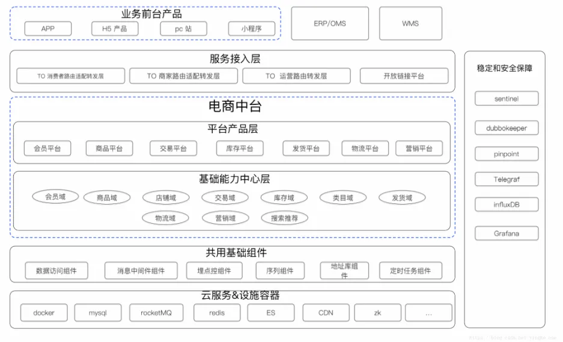
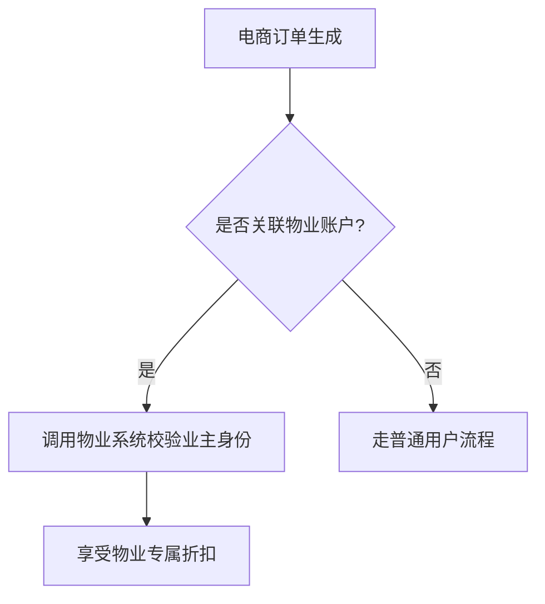
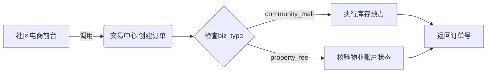

# 项目介绍
## 服务接入层
## 平台产品层
1.会员平台
2.商品平台
3.营销平台
4.订单平台
5.支付平台
6.物流平台
7.搜索平台
8.售后平台
9.客服平台
10.数据分析平台
11.运营平台
12.内容平台
13.社交平台
14.社区平台
15.电商平台
16.电商运营平台
17.电商管理平台
## 基础能力中心层
1.会员域
2.商品域
3.营销域
4.订单域
5.支付域
6.物流域
7.售后域
8.客服域
9.数据分析域
10.运营域
11.内容域
12.社交域
13.社区域
14.电商域
15.电商运营域
16.电商管理域
搜索域


嗯，用户提出了一个智慧社区架构设计的问题，需要评估前台和中台的划分是否合理，尤其是社区电商部分是否应该将库存、商品等模块下沉到交易中心。同时，他们希望设计能兼容智慧社区场景，具备扩展性、低耦合和高通用性。  首先，我需要确认用户当前的架构划分。前台包括智慧物业、社区生活、电商、金融、政务、交友等，中台有交易中心和支付中心。用户觉得社区电商业务复杂，业务流程也比其他模块复杂，所以考虑将电商的库存、商品等下沉到交易中心。但这样做是否合适呢？  接下来，我应该分析社区电商的领域复杂度。库存、商品、物流这些确实是电商的核心模块，但智慧社区的场景可能更垂直，比如物流可能只是同城配送或自提点，与大型电商的全国物流不同。如果将这些模块下沉到中台，可能会导致中台过于臃肿，或者无法满足其他前台模块的需求。例如，社区生活服务可能不需要库存管理，但交易中心如果包含库存，可能会产生不必要的耦合。  然后，考虑中台设计的通用性和扩展性。交易中心如果作为纯业务中台，处理订单、支付等通用流程，而库存、商品等作为能力中台，可能更灵活。这样，各前台模块可以按需调用能力中台的服务，避免重复建设，同时保持低耦合。例如，社区电商需要库存管理，而社区交友不需要，这样能力中台可以独立扩展，不影响其他模块。  另外，需要关注智慧社区的特殊需求，比如与物业系统的联动，社区应急服务等。设计时要考虑这些场景，可能需要扩展物流模块支持自提点，或者库存模块支持物业仓库管理。因此，中台的能力模块需要抽象出通用接口，同时允许定制化扩展。  还要考虑技术实现，比如使用领域驱动设计（DDD）划分限界上下文，确保各模块边界清晰。微服务架构可以支持独立部署，降低耦合。例如，交易中心作为核心域，商品、库存作为支撑域，通过API网关进行交互。  最后，总结建议：将交易中心定位为流程编排中心，处理通用交易流程，而库存、商品等作为独立的能力中台。这样既保持中台的通用性，又允许各前台模块灵活调用所需服务，实现高扩展和低耦合。同时，针对社区特色进行模块扩展，确保架构适应智慧社区的需求。

以下是为智慧社区设计的 **分层架构方案**，针对您提到的业务复杂度和扩展性需求，结合中台化思想给出建议：

---

### 一、架构分层优化建议
#### 1. **前台业务层**（按场景垂直拆分）
```markdown
- 智慧物业    → 物业费缴纳、报事报修、门禁管理
- 社区生活    → 便民服务预约、活动报名
- 社区电商    → 商品交易、拼团、本地配送
- 社区金融    → 物业理财、小额贷款
- 智慧政务    → 政务通知、在线办理
- 社区交友    → 邻里社交、兴趣小组
```


#### 2. **业务中台层**（按能力水平拆分）
```markdown
# 核心中台模块
- 交易中心      → 订单生命周期管理（创建/支付/退款）
- 支付中心      → 多支付渠道聚合、资金对账
- 用户中心      → 统一账户体系（业主/商户/访客）
- 风控中心      → 反欺诈、交易限额控制

# 能力中台（下沉电商核心能力）
- 商品中心      → SPU/SKU管理、价格体系
- 库存中心      → 实时库存管理（支持物业仓库/商户库存）
- 营销中心      → 优惠券、积分、秒杀活动
- 评价中心      → UGC内容管理、评分体系
- 物流中心      → 配送路由（社区自提点/同城配送）
```


#### 3. **技术支撑层**
```markdown
- API网关       → 路由、鉴权、限流
- 消息队列      → 异步解耦（如订单状态变更通知物业系统）
- 分布式事务    → 保证跨服务数据一致性
- 监控平台      → 全链路追踪、异常预警
```


---

### 二、关键设计决策
#### 1. **领域下沉策略**
```xml
<!-- 电商复杂模块处理原则 -->
<下沉到中台>
  ✔️ 商品中心 → 标准化商品模型（兼容物业自营/第三方商品）
  ✔️ 库存中心 → 抽象库存扣减接口（支持电商商品、物业维修配件）
  ❌ 物流中心 → 仅下沉通用配送逻辑（路由算法），保留社区特色扩展点
</下沉到中台>
```


#### 2. **扩展性设计**
```java
// 示例：通过扩展点实现社区特色需求
public class CommunityDeliveryService implements DeliveryStrategy {
    @Override
    public void schedule(Order entity.order) {
        if (entity.order.hasCommunityPickup()) { 
            // 调用物业系统获取自提柜空位
            PropertyService.getPickupLocker().reserve();
        } else {
            // 走标准同城配送流程
            defaultStrategy.schedule(entity.order);
        }
    }
}
```


#### 3. **解耦方案**
```markdown
| 耦合风险点           | 解耦手段                          |
|----------------------|-----------------------------------|
| 电商与物业系统交互    | 事件驱动架构（如物业费抵扣触发优惠券发放）|
| 多业务共享用户数据    | 通过用户中心提供GraphQL聚合接口    |
| 社区特色需求扩展      | 定义SPI接口（如自定义库存预留策略） |
```


---

### 三、智慧社区场景适配建议
#### 1. **库存系统改造**
```python
# 社区电商库存模型需增加字段
class CommunityStock:
    stock_type = Enum('物业仓库', '商户托管', '志愿者代管')  # 适应社区多货源场景
    emergency_reserve = IntegerField()  # 用于台风季物资预留
```


#### 2. **交易流程扩展**



#### 3. **部署架构**
```markdown
- 核心中台服务 → 集群部署保证高可用
- 社区特色模块 → 独立Pod部署（可快速迭代不影响主链路）
- 物业系统对接 → 通过API网关进行流量隔离
```


---

### 四、演进路线建议
1. **Phase 1**: 先建立交易中心、支付中心的通用能力
2. **Phase 2**: 将电商的商品/库存模块抽象为可配置化服务
3. **Phase 3**: 通过插件机制支持社区特色扩展（如自提柜预约插件）

该方案通过 **核心能力下沉+业务扩展点外置** 的设计，既能复用电商领域的成熟模式，又能灵活适应社区场景的特殊需求。


好的，用户之前问的是关于智慧社区架构设计的问题，特别是订单应该放在哪里。之前的回答已经详细讨论了分层架构，包括前台、中台和技术支撑层，并提到了交易中心负责订单生命周期管理。现在用户补充询问订单的具体归属，需要进一步明确订单模块在中台的位置以及如何设计。  首先，我需要回顾之前的架构设计。用户将中台分为交易中心、支付中心、用户中心等，其中交易中心处理订单的生命周期。用户现在可能想知道订单是否应该完全放在交易中心，或者是否有其他考虑因素。比如，社区电商可能有特殊的订单类型，是否需要下沉到中台，或者保留在前台模块中。  接下来，需要分析订单管理的不同方面。通用订单流程，如创建、支付、退款等，应该放在交易中心以确保一致性。但社区特有的需求，比如与物业服务的联动（如物业费抵扣、自提柜预约），可能需要扩展点。这时候，要考虑如何设计交易中心，使其既能处理通用逻辑，又能灵活扩展。  然后，考虑到解耦和扩展性，可能需要将核心订单逻辑放在交易中心，而将业务特定的处理通过插件或扩展点实现。例如，使用策略模式来处理不同的配送方式，或者事件驱动架构来处理订单状态变化后的其他操作，如发送通知或更新库存。  还需要考虑数据模型的设计。订单表结构是否需要包含社区特有的字段，或者通过扩展字段来适应不同业务的需求。比如，社区电商订单可能需要关联物业账户或自提点信息，而普通的电商订单可能不需要这些字段。  此外，用户可能关心如何保持系统的通用性和灵活性。通过微服务架构，将订单服务作为独立模块，通过API网关暴露接口，各个前台业务模块（如社区电商、智慧物业）可以调用统一的订单服务，同时通过扩展点添加特定逻辑。  最后，需要总结订单放置的策略，强调交易中心作为核心，处理通用流程，而特定业务逻辑通过扩展机制实现，确保低耦合和高扩展性。同时，给出部署建议，比如核心服务集群部署，社区模块独立部署，保证稳定性和快速迭代。

以下是关于 **订单模块** 在智慧社区架构中的定位与设计补充说明：

---

### 一、订单模块归属设计原则
#### 1. **核心定位**
```markdown
- ✅ **交易中心（中台层）**  
  负责订单的 _通用流程_（创建、状态流转、支付/退款、日志记录）  
- ✅ **业务前台层**  
  负责订单的 _业务扩展_（社区电商的拼团规则、政务服务的预约凭证逻辑）
```


#### 2. **分层策略**
| 功能                     | 归属层级       | 设计理由                          |
|--------------------------|----------------|-----------------------------------|
| 订单基础模型（ID/金额/状态） | 交易中心       | 所有业务线共享核心数据模型        |
| 社区拼团成团规则          | 社区电商前台   | 业务特性强，需快速迭代            |
| 物业费抵扣优惠逻辑        | 智慧物业前台   | 与物业账户体系深度耦合            |
| 订单履约触发通知          | 交易中心 + 消息队列 | 跨业务通知（如电商发货触发物业快递柜预留）|

---

### 二、订单服务化架构设计
#### 1. **服务边界定义**
```java
// 交易中心订单服务接口示例（核心能力）
public interface OrderService {
    // 通用能力
    Order createOrder(OrderRequest request); // 参数含业务类型标识
    void cancelOrder(String orderId); 
    Order queryOrder(String orderId);
    
    // 扩展点（由各业务模块实现）
    default void afterOrderCreated(Order entity.order) {} // 钩子方法，用于业务扩展
}
```


#### 2. **数据模型设计**
```sql
-- 核心订单表（交易中心）
CREATE TABLE t_order (
    order_id VARCHAR(64) PRIMARY KEY,
    user_id BIGINT,          -- 关联用户中心
    biz_type VARCHAR(32),    -- 业务类型（community_mall/property_payment）
    amount DECIMAL(10,2),
    status ENUM('CREATED','PAID','DELIVERED','COMPLETED','CLOSED'),
    ext_data JSON            -- 业务扩展字段（如社区自提柜编号、政务预约时段）
);
```


#### 3. **社区场景适配方案**



---

### 三、关键设计决策
#### 1. **通用与业务逻辑分离**
```markdown
- **交易中心统一管理**  
  所有订单的 _状态机_、_支付链路_、_逆向流程_（退款/关闭）  
- **业务前台自定义**  
  通过 `biz_type` + `ext_data` 实现业务扩展：
  - 社区电商：ext_data 存储拼团信息、自提点  
  - 智慧政务：ext_data 存储预约时间段、办理事项编码
```


#### 2. **扩展性保障**
```xml
<!-- 通过策略模式实现差异化流程 -->
<entity.order-strategy>
  <biz-type name="community_mall">
    <step>库存预占 → 支付 → 分配自提柜</step>
    <dependency>库存中心 | 物流中心</dependency>
  </biz-type>
  <biz-type name="property_repair">
    <step>工单生成 → 物业派单 → 服务确认</step>
    <dependency>工单系统</dependency>
  </biz-type>
</entity.order-strategy>
```


#### 3. **解耦方案**
```markdown
- **事件驱动**  
  订单状态变更时发布领域事件（如 `OrderPaidEvent`），各业务模块监听处理：  
  - 社区电商：触发发货  
  - 物业系统：更新业主信用分  
  - 消息中心：发送短信通知

- **防腐层设计**  
  在交易中心与物业系统之间设立适配器，转换数据模型（如将订单金额映射为物业费账单周期）
```


---

### 四、运维部署建议
```yaml
# 微服务部署示例
entity.order-service:  # 交易中心核心服务
  replicas: 3
  config: 
    - 统一状态机配置
    - 支付渠道权重

community-entity.order-plugin:  # 社区电商扩展插件 
  replicas: 2
  config:
    - 拼团超时时间
    - 自提柜分配策略
```


---

### 总结
**订单系统的核心能力应沉淀到交易中心**，通过 `biz_type` 实现多业务线支持，利用 _扩展字段_ + _策略模式_ 满足社区场景需求。此设计既保证了通用流程的稳定性，又可通过插件机制快速响应业务创新。