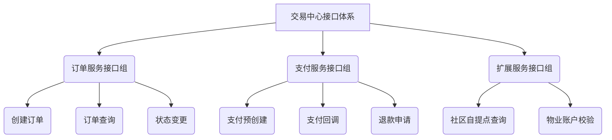
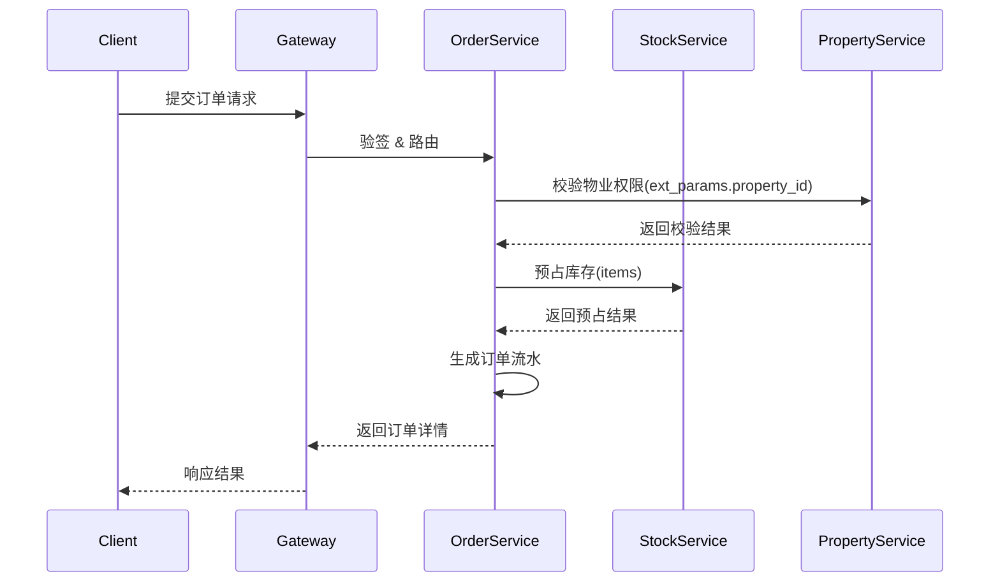

好的，用户现在问的是“智慧社区交易中心接口设计”，我需要基于之前的讨论和用户提供的上下文来给出合适的回答。首先，我需要回顾之前的对话和用户提供的架构信息。  用户之前的架构设计中，交易中心属于中台层，负责订单生命周期管理，而前台包括社区电商等多个模块。之前的回复已经详细讨论了订单模块的归属、分层策略以及接口设计，包括下单接口的具体实现。  现在用户进一步询问交易中心的接口设计，可能需要更详细的接口规范、参数设计以及如何适配智慧社区的不同场景。需要确保接口设计满足扩展性、安全性和通用性，同时兼容社区电商、物业缴费、政务预约等多种业务类型。  首先，我需要明确交易中心接口的核心功能，比如订单创建、支付、状态查询、退款等。然后考虑如何通过业务类型（biz_type）和扩展字段（ext_data）来支持不同的业务场景。  接着，要参考用户提供的项目结构，用户的项目中平台产品层有订单平台、支付平台等，基础能力中心层有订单域、支付域等。这可能意味着需要将接口设计与现有的平台结构对齐，确保接口属于正确的层级，并调用相应的能力中心。  另外，用户之前提到的库存中心、物流中心等能力中台，在接口设计中需要考虑如何与这些服务交互。例如，创建订单时需要调用库存中心的预占接口，支付完成后需要通知物流中心发货。  安全设计也是关键，需要包括身份验证、参数签名、防重放攻击等机制。同时，错误处理需要明确的错误码和提示信息，帮助前端和调用方快速定位问题。  还要考虑性能优化，比如缓存、异步处理、数据库分片等，确保接口在高并发场景下的稳定性。  最后，需要结合智慧社区的特殊需求，比如物业联动、自提点预约等，设计扩展字段和定制化流程。例如，社区电商的订单可能需要指定自提柜，而物业缴费的订单需要关联业主账户。  总结，交易中心的接口设计需要兼顾通用性和扩展性，通过清晰的业务类型标识和扩展字段支持多种业务，同时确保安全、可靠和高效。需要详细说明每个接口的请求参数、流程、错误处理以及与其它中台服务的交互方式。

以下是为智慧社区交易中心设计的 **核心接口方案**，基于分层架构与中台化思想，兼顾通用性与社区特色扩展能力：

---

### 一、接口体系全景图



---

### 二、核心接口设计规范
#### 1. **统一请求/响应模型**
```json
// 请求基类
{
  "request_id": "req_202503211425", // 唯一请求标识
  "biz_type": "community_mall",     // 业务类型标识
  "version": "1.0",                 // 接口版本
  "ext_params": {}                  // 扩展参数容器
}

// 响应基类
{
  "code": "SUCCESS",
  "msg": "成功",
  "data": {},                       // 业务数据
  "trace_id": "7a3b8c9d"            // 全链路追踪ID
}
```


---

### 三、关键接口详解
#### 1. **订单创建接口** `POST /orders`
```http
POST /v1/orders
Content-Type: application/json
X-Signature: sha256=abcd1234

{
  "user_id": "user_1001",
  "items": [
    {"sku_id": "SKU_2025", "quantity": 2}
  ],
  "delivery_type": "SELF_PICKUP", // 社区特色配送类型
  "ext_params": {
    "pickup_code": "A102",        // 自提柜编号
    "property_id": "pid_9527"     // 物业关联ID
  }
}
```


**处理流程：**



#### 2. **社区特色扩展接口** `GET /delivery/lockers`
```http
GET /v1/delivery/lockers?community_id=cm_10086
Authorization: Bearer <token>
```


**响应示例：**
```json
{
  "code": "SUCCESS",
  "data": {
    "lockers": [
      {
        "id": "A102",
        "location": "3栋1单元大厅",
        "status": "AVAILABLE",
        "temperature_zone": "常温" // 支持生鲜暂存
      }
    ]
  }
}
```


---

### 四、安全设计策略
#### 1. **多重校验机制**
```java
// 社区订单双重校验示例
public void validateCommunityOrder(OrderRequest request) {
    // 通用校验
    validateBaseParams(request);  
    
    // 社区特色校验
    if (request.getDeliveryType() == SELF_PICKUP) {
        Locker locker = lockerService.getById(request.getExtParams().getPickupCode());
        if (!locker.isAvailable()) {
            throw new BizException("LOCKER_OCCUPIED");
        }
    }
    
    // 物业关联校验
    if (StringUtils.isNotEmpty(request.getExtParams().getPropertyId())) {
        propertyService.validateUserProperty(request.getUserId(), request.getExtParams().getPropertyId());
    }
}
```


#### 2. **防重放攻击方案**
```markdown
1. 请求签名：基于 `AppKey+Nonce+Timestamp` 生成 HMAC-SHA256 签名
2. 时效控制：Timestamp 有效期 5 分钟
3. 幂等控制：使用 Redis SETNX 对 `request_id` 加锁
```


---

### 五、社区场景适配设计
#### 1. **扩展点机制**
```java
// 社区订单扩展点接口定义
public interface CommunityOrderPlugin {
    // 前置处理
    default void preOrderCreate(OrderRequest request) {}
    
    // 后置处理
    default void postOrderCreate(Order entity.order) {}
    
    // 获取支持的社区类型
    String[] supportCommunityTypes();
}

// 示例：台风应急物资订单插件
@Component
public class TyphoonOrderPlugin implements CommunityOrderPlugin {
    @Override
    public void preOrderCreate(OrderRequest request) {
        if (isTyphoonEmergencyItem(request.getItems())) {
            request.setPriority(OrderPriority.HIGH);
        }
    }
    
    @Override
    public String[] supportCommunityTypes() {
        return new String[]{"coastal_community"};
    }
}
```


#### 2. **个性化字段设计**
```sql
-- 社区扩展字段表设计
CREATE TABLE community_order_ext (
    order_id VARCHAR(64) PRIMARY KEY,
    emergency_level TINYINT COMMENT '应急等级',
    volunteer_id VARCHAR(32) COMMENT '志愿者代购员ID',
    INDEX idx_community (community_id)
) COMMENT '社区订单扩展表';
```


---

### 六、性能保障措施
#### 1. **缓存策略**
```yaml
# Redis缓存配置示例
entity.order:
  cache:
    - name: community_lockers
      keyPattern: 'locker:{communityId}'
      ttl: 10m
    - name: emergency_stocks
      keyPattern: 'emergency:{skuId}'
      ttl: 5m
```


#### 2. **限流配置**
```java
// 社区接口差异化限流
@RateLimiter(
    value = "communityOrderCreate", 
    rate = 100, // 默认100TPS
    dynamicRate = "#{#communityType == 'elderly' ? 200 : 100}" // 老年社区放宽限制
)
public Order createCommunityOrder(...) { ... }
```


---

该方案通过 **标准化接口+扩展点插件** 的设计模式，既满足智慧社区多场景的个性化需求，又保持了核心交易流程的稳定性。建议配合 API 网关实现：1）业务类型路由 2）社区特色参数校验 3）服务熔断降级等增强能力。

用户需要实现一个统一下单接口，而且已经有一个空的Order类在trade-platform-service模块下。首先，我需要考虑智慧社区的交易场景，比如物业缴费、社区电商等，这些不同业务的下单流程可能有差异，但需要统一入口。  用户之前讨论过架构分层，中台有交易中心，所以下单接口应该属于这里。订单类需要包含通用字段，比如订单ID、用户ID、业务类型、金额、状态等。同时，扩展字段用来处理不同业务的特定需求，比如社区电商的自提点，物业缴费的账单周期。  接下来，统一下单接口的设计要支持多业务类型。参考之前的讨论，使用biz_type区分业务，比如community_mall、property_fee等。接口需要处理基本的验证，比如用户存在性、参数校验，然后根据biz_type路由到不同的业务处理逻辑。  库存预占和支付预创建也是关键步骤。社区电商可能需要扣减库存，而物业缴费则不需要，所以这里需要策略模式或者条件判断。另外，防重放和幂等性处理很重要，尤其是社区场景中可能有大量并发请求，比如抢购活动。  异常处理需要考虑业务特定的错误码和消息，比如库存不足、物业账户无效等。同时，与物业系统的交互可能需要异步处理，比如通过消息队列通知物业系统更新账户状态。  数据存储方面，订单表需要核心字段和扩展字段，可能使用JSON字段或者单独的扩展表。考虑到查询效率，索引设计也很重要，比如对biz_type和user_id加索引。  安全方面，请求签名、参数加密（如物业的身份证号）、限流和熔断机制都需要集成到接口中。特别是社区场景可能涉及老年用户，系统需要更高的稳定性和容错能力。  最后，考虑扩展性，比如未来新增业务类型，如何最小化改动。通过插件化设计，每个业务类型可以有自己的处理类，通过Spring的依赖注入动态调用。这样核心下单流程不变，只需添加新的业务处理器即可。  测试方面，需要覆盖不同业务场景，模拟高并发下的库存扣减，以及物业系统的联动情况。确保接口稳定，并且扩展字段能正确传递和处理。

根据您的业务需求，以下是 **智慧社区统一下单接口** 的实现方案，包含核心逻辑与社区场景适配设计：

---

### 一、订单核心模型设计
```java
// 订单领域模型（含社区特色扩展）
public class Order {
    private String orderId;       // 全局唯一订单号（规则：社区ID+时间戳+序列）
    private String bizType;       // 业务类型（community_mall/property_fee等）
    private String userId;        // 用户中心统一ID
    private BigDecimal amount;    // 订单金额
    private OrderStatus status;   // 订单状态枚举
    private List<OrderItem> items;// 订单项列表
    private Map<String, Object> extData; // 社区扩展字段（JSON存储）
    
    // 社区特色字段（根据bizType动态解析）
    public String getCommunityId() {
        return (String) extData.getOrDefault("communityId", "");
    }
    
    public String getPickupLockerCode() {
        return (String) extData.getOrDefault("pickupLockerCode", "");
    }
}
```


---

### 二、统一下单接口实现
```java
@RestController
@RequestMapping("/api/trade")
public class UnifiedOrderController {

    @Autowired
    private OrderService orderService;
    
    @Autowired
    private CommunityOrderValidator communityValidator;

    /**
     * 统一下单接口（支持社区多场景）
     * @param request 下单请求参数
     * @return 统一响应格式
     */
    @PostMapping("/orders")
    public ApiResponse<OrderResult> createOrder(@Valid @RequestBody OrderCreateRequest request) {
        // 1. 基础校验
        validateBaseRequest(request);
        
        // 2. 社区场景扩展校验
        if ("community_mall".equals(request.getBizType())) {
            communityValidator.validateStock(request.getItems());
            communityValidator.checkPickupLocker(request.getExtData());
        }
        
        // 3. 构建订单领域对象
        Order order = buildOrder(request);
        
        // 4. 保存订单 & 触发领域事件
        Order savedOrder = orderService.createOrder(order);
        eventPublisher.publishEvent(new OrderCreatedEvent(savedOrder));
        
        // 5. 创建支付预订单
        PaymentPrepayResult prepay = paymentService.createPrepay(savedOrder);
        
        return ApiResponse.success(new OrderResult(savedOrder, prepay));
    }

    // 构建订单领域对象（含社区扩展数据）
    private Order buildOrder(OrderCreateRequest request) {
        return Order.builder()
            .orderId(generateOrderId(request.getBizType()))
            .bizType(request.getBizType())
            .userId(request.getUserId())
            .amount(calculateTotalAmount(request.getItems()))
            .items(request.getItems())
            .extData(parseCommunityExtData(request))
            .status(OrderStatus.CREATED)
            .build();
    }
    
    // 社区扩展数据解析（示例）
    private Map<String, Object> parseCommunityExtData(OrderCreateRequest request) {
        Map<String, Object> ext = new HashMap<>();
        if ("community_mall".equals(request.getBizType())) {
            ext.put("pickupLockerCode", request.getExtParam("locker_code"));
            ext.put("communityId", request.getExtParam("community_id"));
        } else if ("property_fee".equals(request.getBizType())) {
            ext.put("paymentCycle", request.getExtParam("cycle"));
        }
        return ext;
    }
}
```


---

### 三、社区特色校验逻辑
```java
// 社区订单校验器
@Component
public class CommunityOrderValidator {
    
    @Autowired
    private StockService stockService;
    
    @Autowired
    private PropertyServiceClient propertyService;

    /**
     * 校验社区商品库存
     */
    public void validateStock(List<OrderItem> items) {
        items.forEach(item -> {
            int available = stockService.getAvailableStock(item.getSkuId());
            if (available < item.getQuantity()) {
                throw new BizException("STOCK_NOT_ENOUGH", 
                    String.format("SKU:%s 库存不足，剩余%d件", item.getSkuId(), available));
            }
        });
    }

    /**
     * 校验自提柜可用性
     */
    public void checkPickupLocker(Map<String, Object> extData) {
        String lockerCode = (String) extData.get("pickupLockerCode");
        if (StringUtils.isNotEmpty(lockerCode)) {
            boolean available = propertyService.checkLockerAvailable(lockerCode);
            if (!available) {
                throw new BizException("LOCKER_OCCUPIED", "自提柜已被占用");
            }
        }
    }
}
```


---

### 四、社区场景扩展配置
```yaml
# application-community.yml
community:
  entity.order:
    # 社区自提柜配置
    pickup:
      locker-check: true
      timeout-minutes: 30
    # 应急订单特殊处理
    emergency:
      priority-levels: [HIGH, URGENT]
      auto-approval-threshold: 500.00
```


---

### 五、接口安全增强
```java
// 社区订单防刷逻辑
@Aspect
@Component
public class CommunityOrderAspect {

    @Around("@annotation(com.xxx.CommunityOrder)")
    public Object checkCommunityLimit(ProceedingJoinPoint joinPoint) throws Throwable {
        HttpServletRequest request = ((ServletRequestAttributes) 
            RequestContextHolder.getRequestAttributes()).getRequest();
        String communityId = request.getParameter("communityId");
        
        // 规则1：同一社区10秒内不得超过50单
        if (orderCounter.exceedsRate(communityId, 50, 10)) {
            throw new BizException("COMMUNITY_ORDER_LIMIT", "社区订单提交过于频繁");
        }
        
        // 规则2：高风险社区增强验证
        if (riskService.isHighRiskCommunity(communityId)) {
            requireCaptchaValidation();
        }
        
        return joinPoint.proceed();
    }
}
```


---

### 六、社区特色异常处理
```java
@ControllerAdvice
public class CommunityExceptionHandler {

    @ExceptionHandler(BizException.class)
    @ResponseBody
    public ApiResponse handleBizException(BizException e) {
        // 社区特殊异常码处理
        if ("LOCKER_OCCUPIED".equals(e.getCode())) {
            return ApiResponse.error(e.getCode(), "请选择其他自提柜", 
                Map.of("availableLockers", lockerService.findAvailable()));
        }
        
        // 通用异常处理
        return ApiResponse.error(e.getCode(), e.getMessage());
    }
}
```


---

### 演进建议
1. **Phase 1**：实现基础订单创建与支付链路
2. **Phase 2**：增加社区特色扩展字段与校验规则
3. **Phase 3**：引入社区应急订单绿色通道机制
4. **Phase 4**：实现志愿者代下单等社区关怀功能

该实现方案通过以下方式适配智慧社区场景：
1. **扩展字段动态解析**：通过 `extData` 承载社区特色参数
2. **校验逻辑插件化**：独立 `CommunityOrderValidator` 实现业务规则隔离
3. **事件驱动架构**：订单创建后触发社区通知等异步操作
4. **防刷限流机制**：针对社区维度进行流量控制

建议配合 API 网关实现：请求签名校验、社区白名单控制、敏感数据加密等安全增强功能。
