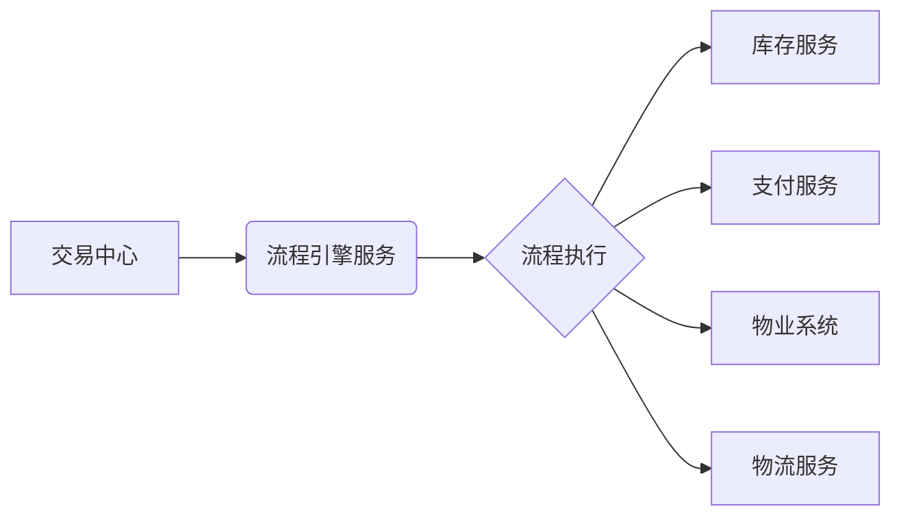
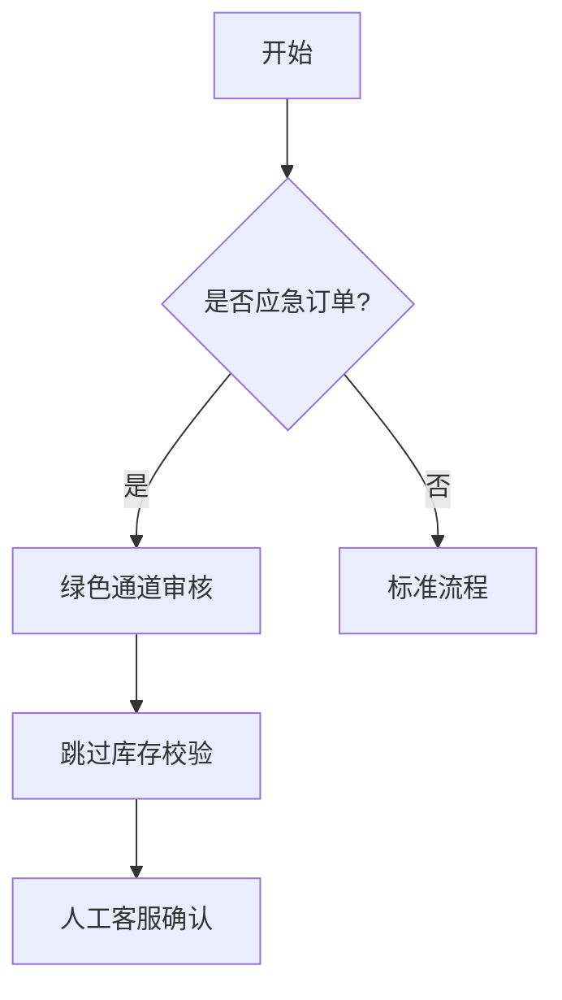

用户现在问的是如何结合流程引擎设计交易流程编排。我需要回顾之前的对话历史，了解他们的系统架构和需求。之前用户已经设计了一个智慧社区的交易平台，划分了前台、中台和技术支撑层，特别是订单模块和统一下单接口的实现。现在他们想引入流程引擎来编排交易流程，提升灵活性和扩展性。  首先，用户的需求可能是在复杂的交易流程中，能够动态调整流程步骤，比如不同的业务类型（社区电商、物业缴费等）有不同的处理步骤，或者需要适应未来业务的变化，而无需修改核心代码。流程引擎可以帮助他们通过配置化的方式管理流程，而不是硬编码。  接下来，我需要确定流程引擎在现有架构中的位置。根据之前的架构设计，交易中心属于中台层，负责订单的生命周期管理。流程引擎应该作为交易中心的一部分，或者作为一个独立的服务，负责编排交易流程中的各个步骤，比如订单创建、支付、库存预占、物流分配等。  然后，考虑如何将现有的订单处理逻辑迁移到流程引擎中。可能需要将每个步骤抽象为流程节点，通过流程定义来描述不同业务类型（biz_type）的处理流程。例如，社区电商的订单可能需要检查库存、分配自提柜，而物业缴费订单则需要校验物业账户状态。  还需要考虑流程引擎的选择，比如使用开源的Camunda、Activiti，或是自研引擎。用户之前提到的系统是Java技术栈，可能更倾向于使用Camunda或Activiti这样的Java友好引擎。不过用户可能需要更轻量级的解决方案，特别是针对特定业务场景的定制需求。  然后，设计流程模型。每个交易流程可以定义为一个BPMN流程图，其中包含服务任务、网关、事件等元素。例如，订单创建成功后触发支付，支付成功后触发物流分配，或者失败时触发补偿逻辑。不同的业务类型有不同的流程定义，根据biz_type路由到对应的流程实例。  另外，需要处理异常情况和事务管理。流程引擎需要支持事务回滚或补偿机制，比如在库存预占失败时，取消整个订单创建流程，并释放已占用的资源。可能需要结合Saga模式来实现分布式事务。  还要考虑性能问题。流程引擎可能会引入额外的开销，特别是在高并发场景下。需要评估引擎的性能，是否支持异步处理、水平扩展等。对于关键路径，可能需要优化流程节点的执行效率，比如使用异步服务任务。  集成现有服务也是重点。流程引擎需要调用现有的库存服务、支付服务、物业服务等，可能需要通过REST或消息队列进行通信。需要设计良好的服务任务，封装这些调用，并处理超时、重试等问题。  扩展性方面，流程引擎应支持动态加载流程定义，无需重启服务。同时，允许开发新的流程节点，比如新增一个风控检查步骤，只需添加对应的节点实现和更新流程定义，而不影响现有流程。  监控和调试也是需要考虑的。流程引擎应提供可视化界面，查看流程实例的状态、日志，方便排查问题。此外，需要集成到现有的监控平台，跟踪流程的执行时间和错误率。  最后，给出具体的实现步骤和建议，比如如何定义流程模型，如何集成到现有的交易中心，如何处理补偿逻辑，以及如何测试和部署流程引擎。同时，结合用户之前的订单接口设计，展示如何将流程引擎嵌入到统一下单流程中，实现流程的可配置化和灵活编排。

以下是为智慧社区交易系统设计的 **流程引擎集成方案**，结合业务流程编排与交易中心核心能力，实现灵活可扩展的交易流程管理：

---

### 一、流程引擎选型与定位
#### 1. **技术选型建议**
```markdown
- 推荐方案: `轻量级DSL引擎` + `Camunda BPMN` 混合模式
- 核心考量:
  ✔️ 社区业务复杂度中等，需快速迭代  
  ✔️ 需支持可视化流程设计器  
  ✔️ 与Spring生态无缝集成
```


#### 2. **架构定位**



---

### 二、核心流程建模
#### 1. **基础交易流程（BPMN 2.0）**
```xml
<!-- 社区电商订单流程示例 -->
<process id="community_order" name="社区电商订单流程">
    <startEvent id="start"/>
    
    <serviceTask id="validate_stock" name="校验库存"
                 camunda:class="com.CommunityStockDelegate"/>
                 
    <serviceTask id="lock_pickup" name="锁定自提柜"
                 camunda:expression="${communityOrderService.lockLocker(execution)}"/>
                 
    <serviceTask id="create_payment" name="创建支付"
                 camunda:delegateExpression="${paymentDelegate}"/>
                 
    <exclusiveGateway id="pay_check"/>
    <sequenceFlow sourceRef="pay_check" targetRef="ship_goods" 
                  camunda:condition="${status == 'PAID'}"/>
    <sequenceFlow sourceRef="pay_check" targetRef="cancel_order"
                  camunda:condition="${status == 'FAILED'}"/>
</process>
```


#### 2. **流程节点类型设计**
```markdown
| 节点类型        | 实现方式                | 社区场景示例                 |
|----------------|------------------------|---------------------------|
| 服务任务        | JavaDelegate实现        | 物业身份校验                |
| 执行监听器      | ExecutionListener      | 应急订单优先级标记          |
| 条件网关        | DMN决策表              | 自提/配送路由决策           |
| 异步延续        | ExternalTask           | 物流状态轮询                |
```


---

### 三、交易流程编排实现
#### 1. **流程服务集成**
```java
// 社区订单流程委托类
public class CommunityOrderDelegate implements JavaDelegate {
    
    @Autowired
    private PropertyService propertyService;

    @Override
    public void execute(DelegateExecution execution) {
        // 获取流程变量
        String communityId = (String) execution.getVariable("communityId");
        
        // 执行社区特色逻辑
        boolean isEmergency = propertyService.checkEmergencyStatus(communityId);
        execution.setVariable("isEmergency", isEmergency);
        
        if (isEmergency) {
            execution.setVariable("priority", "HIGH");
        }
    }
}
```


#### 2. **流程版本控制策略**
```yaml
# 流程部署规则
community-process:
  versioning:
    strategy: business-key-based # 按社区ID绑定流程版本
    fallback-version: 1.0.0     # 默认流程版本
  update-policy: 
    running-instance: continue-old-version # 已运行流程继续旧版本
```


---

### 四、社区特色流程扩展
#### 1. **应急物资采购流程**



#### 2. **流程补偿机制**
```java
// 社区自提柜锁定补偿处理器
@Component
public class LockerCompensationHandler {

    @Compensate
    public void compensateLock(CommunityOrderContext context) {
        lockerService.release(context.getLockerCode());
        log.info("释放自提柜: {}", context.getLockerCode());
    }
}
```


---

### 五、关键集成设计
#### 1. **事务管理策略**
```markdown
- 采用 `Saga模式` 管理长事务流程
- 补偿触发条件:
  1. 服务调用超时（>3秒）
  2. 业务校验失败
  3. 显式回滚指令
```


#### 2. **流程监控看板**
```java
// 社区流程监控指标
@Bean
public MeterRegistryCustomizer<MeterRegistry> communityMetrics() {
    return registry -> {
        Gauge.builder("process.community.active", 
                () -> runtimeService.createProcessInstanceQuery()
                    .processDefinitionKey("community_order")
                    .count())
            .register(registry);
    };
}
```


---

### 六、演进路线建议
1. **Phase 1**：核心交易流程引擎化（创建-支付-完成）
2. **Phase 2**：增加社区特色扩展节点（自提柜/应急通道）
3. **Phase 3**：实现流程动态热更新能力
4. **Phase 4**：构建可视化流程编排控制台

---

### 架构收益分析
```markdown
| 传统编码方式                | 流程引擎编排方式           |
|---------------------------|--------------------------|
| 业务逻辑硬编码，改造成本高    | 通过BPMN配置快速调整流程   |
| 事务管理耦合在代码中         | 通过Saga模式可视化管理     |
| 扩展新场景需修改核心逻辑      | 通过插件机制扩展新节点     |
| 流程监控困难               | 内置流程实例追踪能力       |
```


该方案通过流程引擎实现 **业务逻辑与技术实现解耦**，使交易中心具备以下能力：
1. **灵活调整**：通过修改流程定义响应业务变化
2. **可视化管控**：实时监控各社区交易流程状态
3. **安全演进**：旧流程实例不受新版本影响
4. **快速试错**：支持AB测试不同流程版本